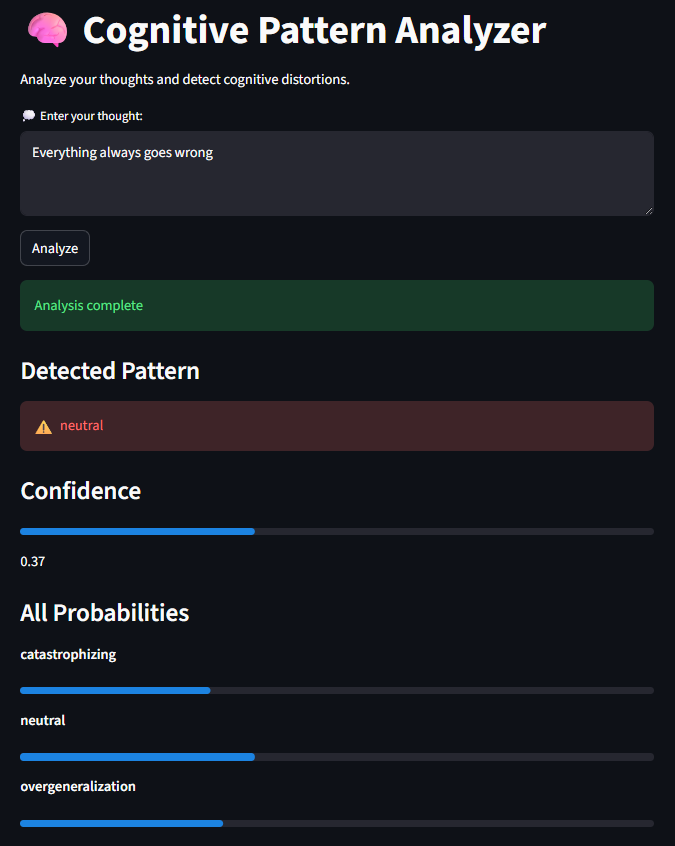

# 🧠 Cognitive Pattern Analyzer

AI-powered NLP application that detects cognitive distortions from user thoughts using Machine Learning and semantic embeddings.

Built with FastAPI, Streamlit, Sentence Transformers, and Scikit-learn.


---

## ✨ Features

- Detects cognitive distortions from text
- Semantic embeddings using Sentence Transformers
- FastAPI backend architecture
- Interactive Streamlit frontend
- Confidence score visualization
- REST API integration
- Real-time prediction pipeline
- Structured logging and error handling

---

## 🏗️ Architecture

User → Streamlit UI → FastAPI → ML Model → Prediction

---

## 📂 Project Structure

````
app/
  ├── main.py        # FastAPI app
  ├── routes.py      # API endpoints
  ├── schemas.py     # Request/response models
  ├── services.py    # Business logic
  └── app_ui.py      # Streamlit UI
  └── logger.py      

model/
  ├── loader.py      # Loads ML pipeline
  └── *.pkl          # Trained models

notebooks/
  └── training.ipynb

data/

# 🔥 HOW TO RUN

```md id="65"
## 🚀 Run Locally

### 1. Clone repository

```bash
git clone <repo_url>
cd Cognitive-Pattern-Analyzer_v2

---

## ⚙️ Setup

```bash
pip install -r requirements.txt
````

---

## ▶️ Run API

```bash
uvicorn app.main:app --reload
```

---

## 🎨 Run UI

```bash
streamlit run app/app_ui.py
```

---

# 🔥 API EXAMPLE

```md id="66"
## 🔌 API Example

POST `/predict`

Request:

```json
{
  "text": "I ruin everything"
}

---

## 📡 API Endpoint

POST `/predict`

```json
{
  "text": "I always fail"
}
```

Response:

```json
{
  "success": true,
  "prediction": "catastrophizing",
  "confidence": 0.488
}
```

---

## 🛠️ Tech Stack

### Frontend
- Streamlit

### Backend
- FastAPI
- Uvicorn
- Pydantic

### Machine Learning
- Sentence Transformers
- Scikit-learn
- PyTorch

### Utilities
- NumPy
- Pandas
- Logging

---

# 🔥 FUTURE IMPROVEMENTS

```md id="67"
## 🚧 Future Improvements

- Docker support
- CI/CD pipeline
- Render deployment
- Model explainability
- Authentication
- Dashboard analytics
- Advanced NLP models

* Model explainability
* Multi-language support
* User history tracking
* Deployment (cloud)

---

## 🧠 Skills Demonstrated

- NLP Engineering
- REST API Development
- Frontend/Backend Integration
- Machine Learning Inference
- Semantic Embeddings
- FastAPI Architecture
- Streamlit UI Development
- Error Handling & Logging
- Modular Software Design

## 👩‍💻 Author

Vanessa Duarte
